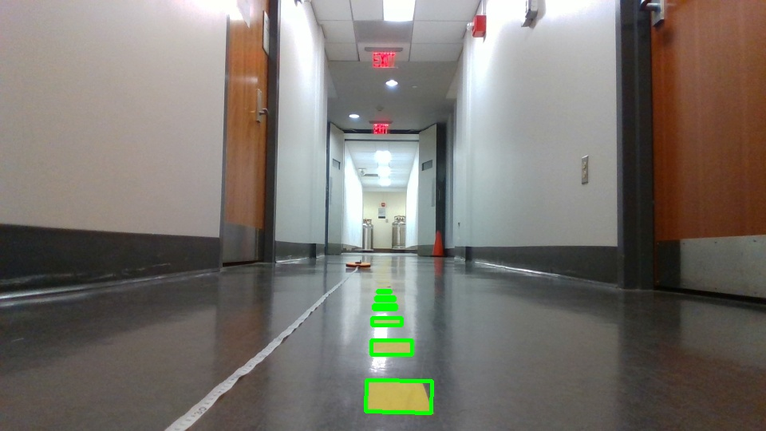
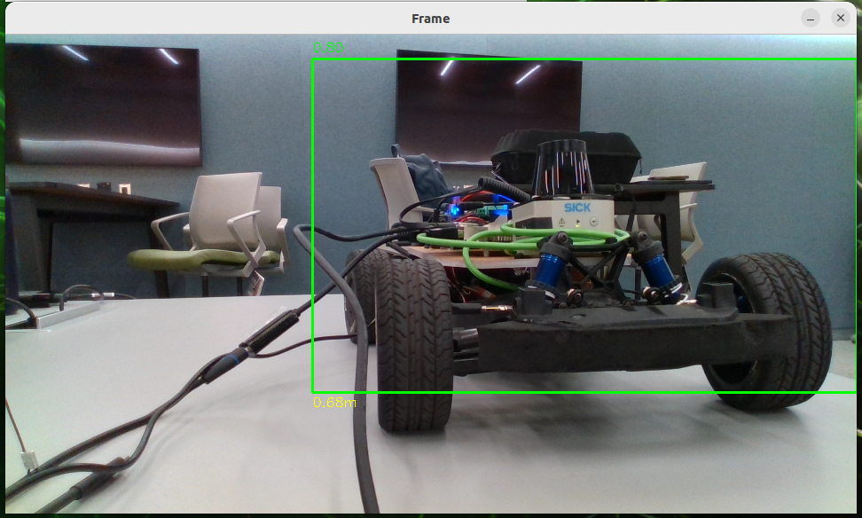
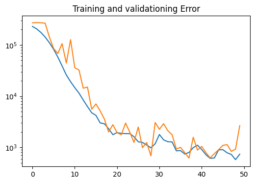

# Lab 8: Vision Lab

## The x, y distance of the unknown cones?
x_car = 0.6001 m
y_car = 0.1293 m

## Lane Detection Result Image

## Integrated Object Detection + Distance Calculation Result Image

## Nerual Network Training & Testing Loss Plot

## Is FP16 faster? Why?

FP16 inference time (ms): 1.256

FP32 inference time (ms): 1.553

(Tested for 100 inference cycles using [python_scripts/benchmark_trt.py](python_scripts/benchmark_trt.py))

FP16 is faster because it uses half the numerical precision and so computations are significantly faster.

You should time only the inference part and average out at least 100 inference cycles.

## Submission Package

The standalone ROS package used for the integrated lane detection and object detection run is copied in [vision_integration_pkg](vision_integration_pkg).
